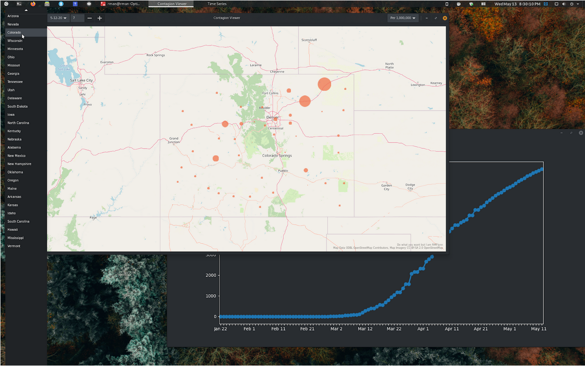

# Contagion View GTK


### Introduction:

Every one  has been affected by the Corona virus outbreak. When I started this project I did not honestly imagine that this crisis would stretch so far both socially and geographically. One of the many side effects of COVID-19 has been to make us hyper aware of how our social actions can impact our health, and the health of our community. 

Long after the current health crisis has passed, contagions will continue to be a significant threat to public health. With this in mind I created an application to acquire up-to-date information about the spread of COVID-19. I believe that a visualization is a good tool to communicate the risks, and encourage appropriate action.  

### Install/Use:

Contagion View has only been tested on Ubuntu 19.10 and 20.4.
Python3 and pip should be installed and up to date.
I also suggest you consider running this program in a [virtual environment](https://docs.python.org/3/library/venv.html).


Download or clone the git repository 

>> git clone https://github.com/rmFlynn/contagion_view_gtk.git

Install prerequisites 

```
sudo apt install libchamplain-gtk-0.12-0 python-gi
pip install wheel pycairo pandas numpy matplotlib seaborn 
pip install vext
pip install vext.gi
```


With the prerequisites installed the typical user should only need to execute:

>> python covid19_gtk.py 

If you want to update the data files your self you will need to understand and fallow the instructions in the next section.

### Datasets:

We have seen a plethora of coronavirus datasets, death counts, infection counts, and even flight cancellations. However, none of these tools seemed sufficient for the casual person in quarantine to understand the ongoing threat. For both experts and individuals, decisions will be made based on comparison across  demographics, locations, and time. Data across all dimensions is easily available but combinations of all three dimensions is less so. The first important task is to combine these datasets.


##### COVID-19 Data:


**Provider: **Johns Hopkins Coronavirus Resource Center [https://github.com/CSSEGISandData/COVID-19](https://github.com/CSSEGISandData/COVID-19) 


**Format: **A set of 59 CSV files here after referred to as Daily reports, 7 columns by up to 293 rows each. Also, a second set of 3 CSV files here after referred to as time series data, 71 columns by 489 rows each.


**Description:**


Daily reports: one for each day of the year since 1/22/2020, that wasn't that long ago, but it captures every case ever confirmed in the United States, that's how quickly this all happened. The location of the outbreaks are mostly by county but not entirely that is why the map data is necessary. The longitude and latitude of each case is included.


**Acquisition commands:**


> git submodule update --init


##### Map data:


**Provider: **Data.gov, a platform hosting data from the US census.


[https://catalog.data.gov/dataset/tiger-line-shapefile-2017-nation-u-s-current-county-and-equivalent-national-shapefile](https://catalog.data.gov/dataset/tiger-line-shapefile-2017-nation-u-s-current-county-and-equivalent-national-shapefile) 


**Format: **A shape file compatible with GeoPandas which treats it as a data frame


**Description:**


Each row of this file contains the county and state name and its shape, along with  some other information that is not necessary. This is mostly used to aggregate COVID19 outbreaks into counties. GeoPandas provides tools to join the longitude at latitude in the John Hopkins data, to the shape those points fall into. Then the center of each county shape is then used as an aggregate point which takes up exponentially less space.


**Acquisition commands:**


> wget ftp://ftp2.census.gov/geo/tiger/TIGER2019/COUNTY/tl_2019_us_county.zip
> unzip tl_2019_us_county.zip -d us_county_shapes
> rm tl_2019_us_county.*


##### Population data:


**Provider: **The US Census department 


[https://www2.census.gov/programs-surveys/popest/datasets/2010-2019/counties/totals/](https://www2.census.gov/programs-surveys/popest/datasets/2010-2019/counties/totals/) 


**Format: **A simple data frame/ data table


**Description:**


This is the most straightforward data set of all. This contains state and county names along with population. The data is joined on state and county to make the final dataset.


**Acquisition commands:**


> Wget [https://www2.census.gov/programs-surveys/popest/datasets/2010-2019/counties/totals/co-est2019-alldata.csv](https://www2.census.gov/programs-surveys/popest/datasets/2010-2019/counties/totals/co-est2019-alldata.csv)


##### Generated Data:

The above data sets contain all the information necessary to build the visualization, however they are reformatted before they are actually used. In a real-world use case only this reformatted data would be downloaded, from an up-to-date  web portal. 

The modified data is split into four data files each of which is loaded at different times when using the visualization. The format is basically the same across all files. Each is a table with rows containing the location, case number, and population of one location for all days since the outbreak first began in Seattle. Two of these tables contain the number of cases per million people in each county. This calculation takes a long time when done over this much data, so it is done in advance. The other two tables are used when viewing total cases. 

Displaying information for all the counties in the US slightly overwhelms the system and ruins the user experience. Therefore, within each set of two files only one contains all the data. Called the state data-set, this file is only used when the user is filtering by state. Immediately after being loaded, the data for the state of interest is selected and the rest of the data discarded. This way the system is not overwhelmed.

When the user looks at the Nationwide view the other file is loaded. This file is filtered such that the top 100 cases on any given day are included. Counties that have never been in the highest 100 on any day since the outbreak are dropped. Given the dynamic nature of the virus this means that the data set still contains many hundreds of points, but this is still much more manageable than the full set seeing as now that the virus has spread to nearly every county in the Union. 

A much better solution to this problem could be found, and should be the subject of future work.

**Interactions:**

Final version of the visualization includes three menus, one to select the date, one to select the Nation view or a state, and one for total vs number of cases per million. You can scroll with your mouse over the menu, as an additional form of navigation. 

There is also a tool to adjust the zoom level on the map, but you can scroll on the map to zoom as well. Clicking and dragging will change the part of the map that's in focus. The zoom tool came as part of the libChamplain example, and I kept it in the rare instances it might be useful.

When you click on a point a label appears giving information such as total population, relative count, and the name of the state and county. This is key since the map only gives a general sense of these aspects. Once this label has been generated it updates as you change the date. In addition to generating the label the corresponding data row is also added to the timeline view. This view allows you to better understand how the rate of infection has changed over time.

This is a simple design but highly effective.


### Here's an example of a typical interaction with the Contagion View app.





##### Future Work

The number of ways that I think things could be improved are innumerable. The first thing that needs to be done is to rework some code to make it absolutely seamless. Because this was done primarily for a visualization project, the code is not yet up to par with what would be necessary for a long-term professional project. However, it's a testament to the design of python and GTK that it's very close. It only needs a few hours or days work to be ready for sharing, and possibly open source collaboration. Once that project is complete, all the rest of the alterations I've mentioned will be easy to accomplish in a matter of minutes each. 
